# **Shirking in Major League Baseball (MLB)**  
**Author:** Aaron Rofe  
**Date:** December 2024  
**Type:** Undergraduate Senior Thesis  
**Tools:** R, Generalized Additive Models (GAMs), baseballr, Spotrac, Fangraphs  

---

## **Overview**

This project investigates *shirking behavior* in Major League Baseball — the idea that players may reduce effort or performance after signing long-term, guaranteed contracts. Using more than a decade of salary, contract, demographic, and performance data, this thesis evaluates whether contract characteristics such as salary increases and contract length predict declines in player performance.

The research also builds predictive models to forecast shirking for the 2025 free agent class, offering a data-driven framework that MLB front offices could use to assess contract risk.

---

## **Research Question**

**To what extent do MLB players exhibit shirking behavior after signing new contracts, and can future shirking be accurately predicted for upcoming free agents?**

---

## **Background**

Shirking has been widely studied in economics and organizational behavior, but sports provide an ideal setting because performance is highly measurable. Prior research suggests:

- Job security may decrease effort  
- Salary increases can weaken performance incentives  
- Fully guaranteed MLB contracts increase shirking risk relative to leagues with non-guaranteed deals  
- Machine learning improves prediction of player value and performance volatility  

This study expands on past work by including player upbringing (domestic vs. international backgrounds) to test whether economic or developmental circumstances affect shirking behavior.

---

## **Data Sources**

- **Spotrac:** Salary, contract length, contract type, and free agent lists  
- **Fangraphs:** Player performance statistics  
- **baseballr (R):** Player demographics (including birthplace), WAR, and stat retrieval  
- **maps (R):** City population data used to construct market size variables  

Dataset includes **contracts from 2011–2024**, filtered to the top 500 salaries per year and excluding arbitration-only deals.

Birthplace data from `mlb_people` in baseballr was used to create an international player indicator. Many international players come from economically disadvantaged regions (e.g., Dominican Republic, Venezuela, Cuba), allowing exploration of whether players from these backgrounds display different shirking patterns once they secure long-term financial security.

Final sample sizes:
- **898 observations** — batters  
- **885 observations** — pitchers  

---

## **Summary Statistics**

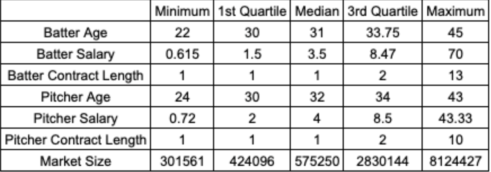

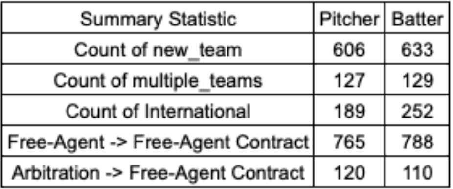

___

## **Methodology**

### **1. Measuring Shirking**

Shirking is defined as:

Delta WAR = WAR(First Year of New Contract) - WAR(Contract Year)

A negative value implies potential shirking.

---

### **2. Modeling Performance Decline**

A **Generalized Additive Model (GAM)** captures nonlinear relationships:

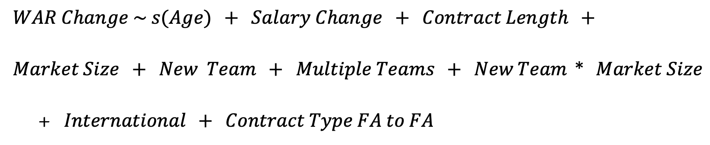

Models were run separately for:
- **Batters**
- **Pitchers**

An indicator for **international players** was included to examine whether upbringing or economic background affects shirking behavior. This tests the hypothesis that players from disadvantaged regions may be highly motivated early in their careers but could exhibit reduced effort once major financial security is achieved.

Salary outlier tests and RMSE validation were performed.

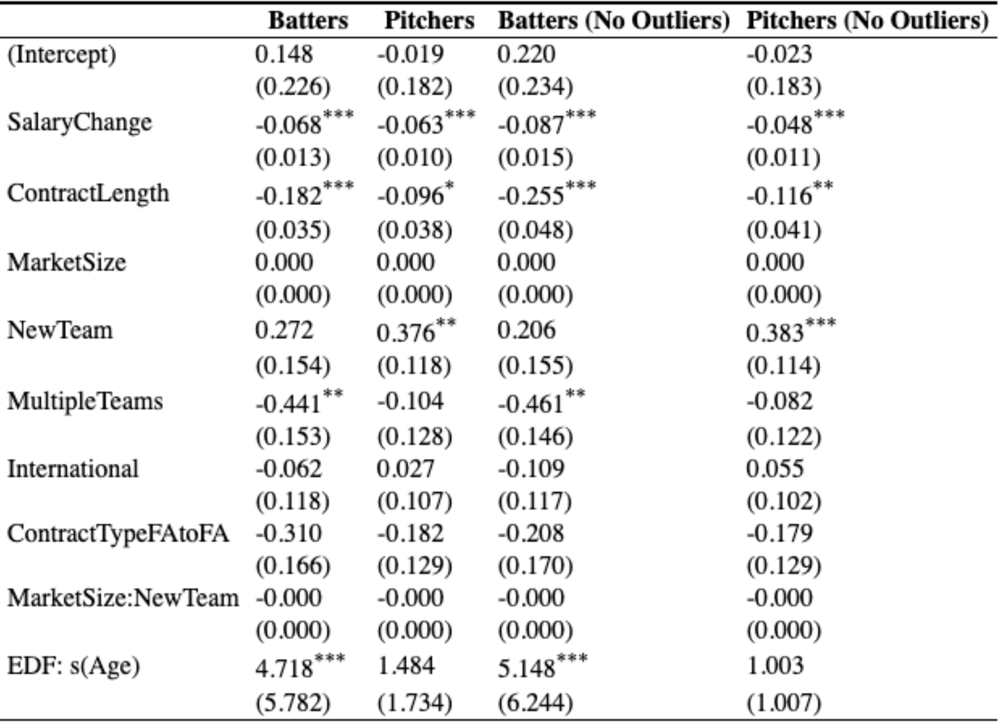

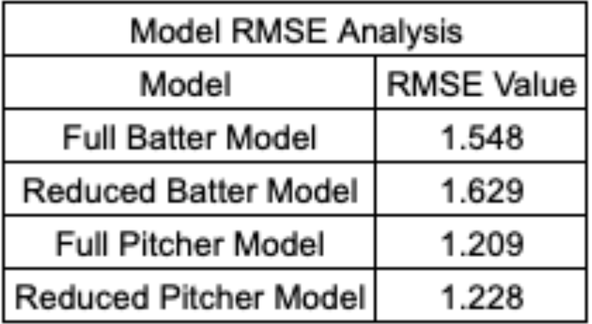

### **Model Results & RMSE Interpretation**

Across all four GAMs (batters and pitchers, with and without salary outliers), the results were highly consistent. In every specification, **salary change** and **contract length** remained significant predictors of ΔWAR with **negative coefficients**, reinforcing the core shirking hypothesis:

- Larger raises → larger performance declines  
- Longer contracts → greater first-year drop-off  

Market size, team change for hitters, and the international upbringing proxy did not show meaningful effects. For pitchers, however, **switching teams showed a positive and significant impact**, suggesting improved performance when moving to a new organizational environment, coaching staff, or pitch development system.

Removing salary outliers did **not** alter the substantive results. Coefficients remained similar in magnitude and significance, indicating the patterns observed were not driven by extreme contract values.

To assess model performance, I compared **full models** (including salary change + contract length) with **reduced models** (excluding those variables) using an 80/20 train-test split. In both hitter and pitcher datasets, the **full models produced lower RMSE values**, demonstrating stronger predictive accuracy. This confirms that contract characteristics are not only statistically significant—they meaningfully improve the model’s ability to predict performance decline.

---

### **3. Predicting Shirking for 2025 Free Agents**

Two intermediate GAMs were built to predict missing contract variables: **Predicted Salary** and **Predicted Contract Length**.

**For Hitters:**

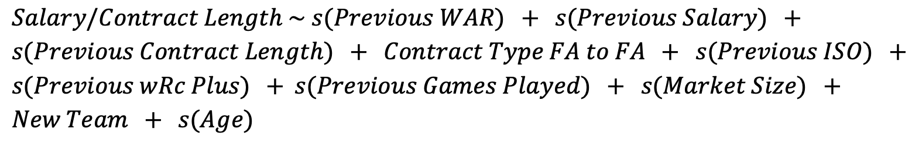

**For Pitchers:**

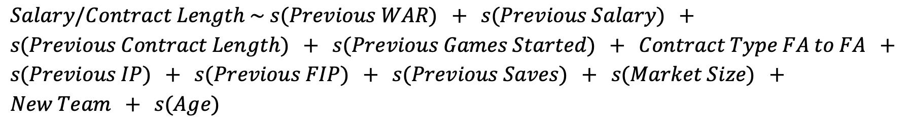

These predictions then feed into the main shirking model to generate ΔWAR forecasts for 2025 free agents.

**Salary + Contract Length RMSE:**

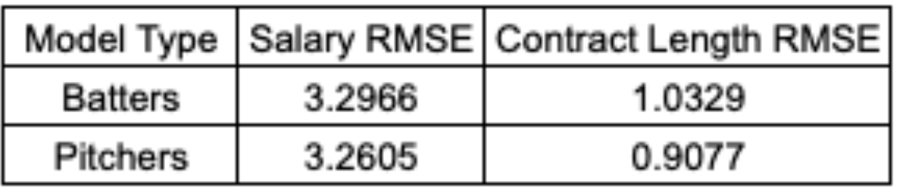

---

## **Key Findings**

### **1. Evidence of Shirking**
Both **salary increase** and **contract length** have significant **negative effects** on ΔWAR:

- Larger raises → larger performance declines  
- Longer contracts → greater first-year drop  

This pattern holds for both hitters and pitchers.

---

### **2. Market Size & Upbringing Proxy Not Significant**
- Big-market vs. small-market teams did **not** significantly affect performance change  
- The **international player indicator** (used as a proxy for upbringing/economic background) showed **no meaningful difference** in shirking behavior  

---

### **3. Pitchers Perform Better When Changing Teams**
Pitchers switching teams often see **improved** performance, potentially due to coaching or organizational fit.

Hitters do not show this effect.

---

### **4. 2025 Free Agent Predictions**

Examples:

- **Corbin Burnes** – predicted salary ~$30.6M → projected ΔWAR ≈ **–1.02**  
- **Juan Soto** – extremely high salary skews model, but predicted decline driven by long-term contract penalty  

These outputs highlight how nonlinear salary distributions influence GAM forecasts.

---

## **2025 Free Agent Prediction Tables**

### **Top Predicted WAR Change – Hitters**

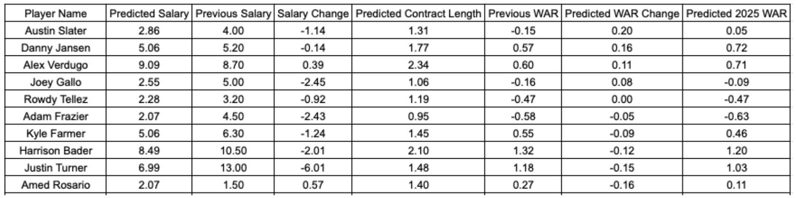

### **Lowest Predicted WAR Change – Hitters**

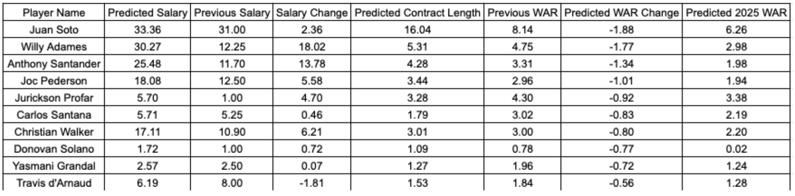

### **Top Predicted WAR Change – Pitchers**

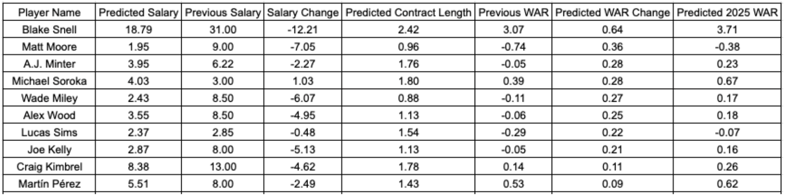

### **Lowest Predicted WAR Change – Pitchers**

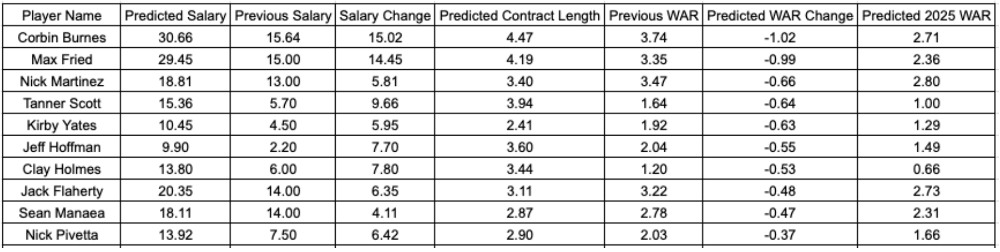

---

## **Conclusion**

Results provide strong evidence that MLB players experience performance declines after receiving:

- **Large salary increases**  
- **Long-term guaranteed contracts**

This framework can help MLB teams:

- Evaluate contract risk  
- Predict future shirking  
- Improve roster construction strategy  

Predictions for superstar players should be interpreted cautiously due to extreme salary distributions, the nature of MLB contracts, and offseason market dynamics.

---

## **Files Included**

- [thesis_final.pdf](thesis_final.pdf) – Full paper  
- [code](code/) – All R scripts for data cleaning, modeling & prediction  
- [data](data/) – Raw and cleaned datasets used for analysis  
